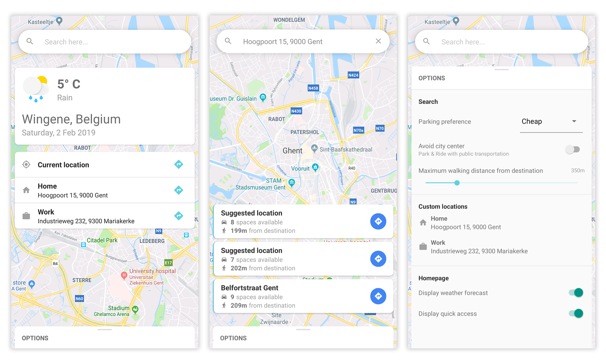

# Spark  |  Team Ghent

## React Native application

This project was created for the Web of Things course at Artevelde University College in Ghent. During this course, a group of students accepted a challenge to compete with a team from Amsterdam and a team from Stuttgart. The goal was to use modern technology in an attempt to ease the parking process in big cities, which would lead to lowering CO2 emmissions and bettering traffic flow in city centers. This project is the result of a semester's worth of brainstorming, planning and programming.

## Screenshots



## Technologies

- React Native with Expo
	- Redux

## Installation and setup

### Client

```bash
# Clone the repository
git clone https://github.com/manatran/spark-client.git

# Navigate into the directory
cd spark-client

# Install the dependencies
yarn install

# Run the React Native application in development mode
yarn start

# Scan the QR code with the Expo app on Android or Camera app on iOS
```

### Server

The app is powered by a Node.js REST API and uses the following endpoint to get our data:

```
GET /search
```

This endpoint requires you to send the following parameters

> `lat`: Latitude of destination

> `lng`: Longitude of destination

> `radius`: Maximum distance from destination in km. Defaults to 0.5.

> `car_length`: Length of your vehicle in m. Defaults to 4.

The server for this project is hosted on Heroku. This is what your fetch URL might look like: 

`https://spark-node.herokuapp.com/search?lat=51.036877&lng=3.712618&radius=0.1&car_length=4`

## Try it out

We hosted the app on Expo, allowing users to try it out by scanning this QR code with the Expo app. Due to restrictions set by Apple, this will only works on Android devices. You can also view the app on [Expo](https://expo.io/@manaus_t/spark) directly.


## Contributors

* **Manaus Transez** - [GitHub](https://github.com/manatran)
* **Yens Broothaers** - [GitHub](https://github.com/yensbroo)


## License

Licensed under the MIT license.